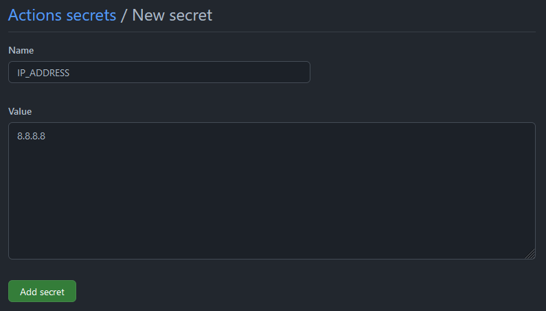
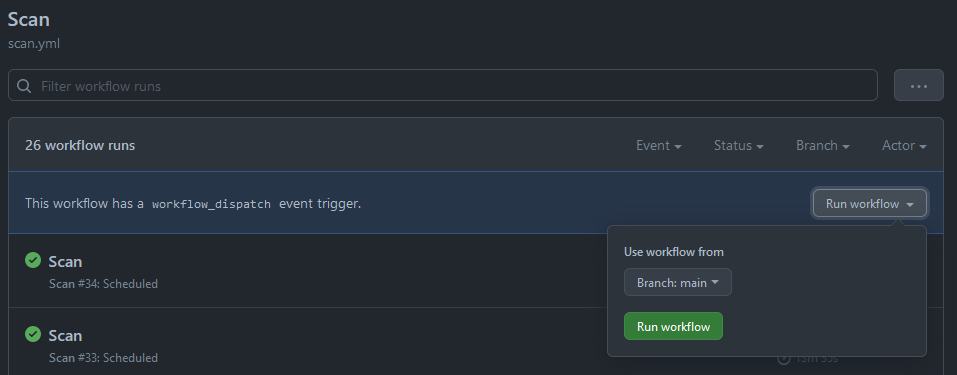
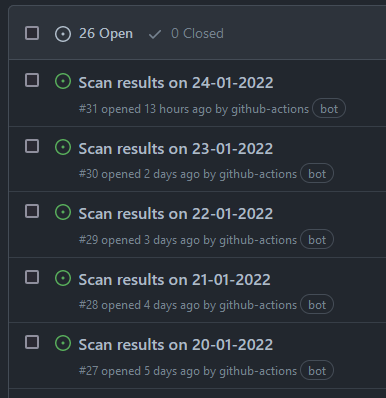

# MonitorMyPublicIP

This repository contains code for a workflow that performs a daily `nmap` scan for open ports on a target (specified by the `IP_ADDRESS` Github secret) and exports the results into an issue on this repository.

Any IP addresses in the results have been intentionally censored for privacy reasons.

## Features
* Performs a `nmap` scan daily on the target defined by the `IP_ADDRESS` secret.
* Supports on-demand scans.
* Reports results as Github issues.

## Simple Usage
1. Fork this repository to your Github account.
2. Create a new repository secret by following this [link](https://docs.github.com/en/actions/security-guides/encrypted-secrets#creating-encrypted-secrets-for-a-repository) with the name `IP_ADDRESS` and its value set to the IP address that you wish to scan. (e.g `8.8.8.8`)   

3. Wait for the workflow to run or manually trigger it by following this [link](https://docs.github.com/en/actions/managing-workflow-runs/manually-running-a-workflow#running-a-workflow).  

4. Observe the scan report on the Issues page of the forked repository.  

## FAQ
Question: How do I define **when** the workflow executes?  
Answer: You can set the `cron` schedule defined in `.github/workflows/scan.yml`. Read [this](https://docs.github.com/en/actions/using-workflows/events-that-trigger-workflows#schedule) to learn more about it.
